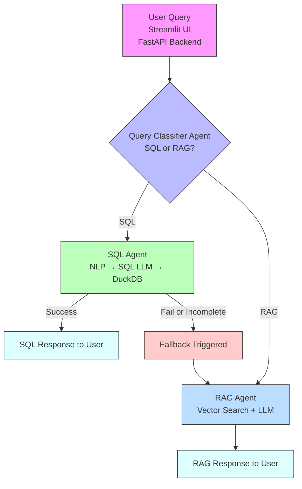

# **Project Report**
## **FinSight - AI document assistant - A Role-Based Access Control System**

## **Business Problem:**

1. FinSolve Technologies faced operational inefficiencies caused by communication delays and fragmented, siloed data across departments including Finance, Marketing, HR, and Executive leadership.
2. Departmental isolation limited timely access to relevant information, slowing decision-making, strategic planning, and project execution.
3. The organization required a secure, role-based AI solution to deliver on-demand, department-specific insights while enforcing strict access controls to maintain data confidentiality and operational efficiency.

## **Project Overview**

This project implements an advanced **Retrieval-Augmented Generation (RAG)** system tailored for multi-role enterprise environments. Users can upload documents (Markdown, CSV), and the system retrieves answers based on the user's role. Queries are classified and routed accordingly — SQL-type queries are translated to SQL using an LLM and executed on DuckDB, while RAG-type queries are answered via the retrieval-augmented generation pipeline, and responses are enhanced by reranking and evaluated for quality. The architecture includes:

* **Streamlit UI**: for user login, role-based access, and document upload.
* **FastAPI backend**: for business logic, user management, and RAG handling.
* **Query Classifier agent**: to route user queries to the appropriate retrieval mode.
* **SQL Agent**: processes structured data queries using an LLM for translation and DuckDB for execution.
* **RAG Agent**: retrieves and synthesizes responses from unstructured documents using embeddings and LLMs.
* **DuckDB**: for SQL-like queries over structured data (CSV).
* **Chroma vector store**: for dense embedding search (unstructured).
* **Fallback Mechanism**: to ensure graceful degradation when structured query fails.

## **System Architecture Diagram**


### **Architecture Overview**

* Combines **structured data querying (SQL)** with **unstructured document retrieval (RAG)**.
* Ensures **high accuracy and flexibility** by selecting the most appropriate engine per query.
* Implements **fallback logic** for robustness — the user always gets a meaningful response.
* This system is designed to intelligently respond to user queries using either **structured SQL** or **unstructured RAG** depending on the nature of the query.

### **End-to-End Flow:**
#### 1. **User Interface Layer**
* A user enters a question through a **Streamlit UI**.
* This query is sent to the **FastAPI backend**, which handles the core logic.

#### 2. **Query Classification**
* The query first reaches a **Query Classifier Agent**, which analyzes it and decides:
  * **Is this a structured query?** (e.g., about data in a table)
  * **Or an unstructured query?** (e.g., asking for procedural guidance)

#### 3. **SQL Agent Path**
* If the classifier determines it's an **SQL-type query**:
  * The query goes to the **SQL Agent**, which uses an **LLM to convert natural language into SQL**.
  * The generated SQL is executed using **DuckDB**, a fast in-process SQL engine.
  * If the query executes successfully, the result is sent back to the user as a **SQL Response**.
    
#### 4. **Fallback Mechanism**
* If the SQL query **fails** or the response is **incomplete**, a **Fallback Trigger** is activated.
* The system automatically reroutes the query to the **RAG Agent**.

#### 5. **RAG Agent Path**

* The **RAG Agent** retrieves relevant information from documents using **Vector Search** (e.g., via ChromaDB).
* The LLM then generates a coherent answer from the retrieved chunks.
* The final **RAG-based response** is sent back to the user.


## **Key Features**

### **1. Role-Based Access Control**
* Users are assigned roles (e.g., HR, Finance, QA).
* Each document is tagged with the role it’s meant for.
* Queries are filtered to only retrieve content associated with the user's role.

### **2. Dual Query Handling (RAG + SQL)**
* **Unstructured queries** (e.g., "What are the QA best practices?") → handled by Chroma vector search + LLM.
* **Structured queries** (e.g., "Show me all employees with salary > 100K") → handled via DuckDB.
  
| Mode    | Triggered When              | Engine            |
| ------- | --------------------------- | ----------------- |
| **RAG** | General, text-based queries | Chroma DB + LLM   |
| **SQL** | Structured/tabular queries  | DuckDB SQL engine |


## **3. Why DuckDB for Structured Queries?**
Adopted **DuckDB** for handling structured queries on uploaded CSVs because:

* **In-process SQL engine**: DuckDB runs embedded in Python, no separate server needed.
* **Zero setup**: No configuration required; great for file-based structured queries.
* **Lightweight + Fast**: Efficiently handles large CSV files in memory.
* **Supports Pandas + SQL natively**: Easy to switch between Python dataframes and SQL.
* **Isolated query execution**: Each user session can be sandboxed.

This made DuckDB a perfect fit for answering precise, structured queries over tabular data uploaded by the user.


## **4. Query Classification Module**
A **query classifier** was implemented to determine the intent behind the user's input:

| Intent | Target System | Example Query                     |
| ------ | ------------- | --------------------------------- |
| RAG    | Chroma + LLM  | “Summarize this finance document” |
| SQL    | DuckDB        | “List employees earning over $50k”|

* The classifier directs the query to either:
  * RAG (textual search in vector DB),
  * SQL (execute structured query using DuckDB).
This significantly **improved accuracy and speed**, avoiding LLM overhead when a SQL answer sufficed.

## **5. Fallback Handling Strategy**
In edge cases, a **fallback mechanism** is implemented:
1. If a **SQL query fails** (e.g., malformed, missing table):
   * Log the error,
   * Fallback to the RAG system with rephrased prompt like:
     *"Unable to process SQL. Try answering from available documents instead."*

2. If **no relevant docs** found in RAG:
   * Return a graceful message,
   * Suggest rephrasing or uploading new content.
This ensures the system is **resilient** and never leaves the user with a hard error.

## **7. Evaluation Framework for RAG (LLM-RAG Eval)**
An **automated evaluation pipeline** to assess output quality. It generates question-answer (QA) pairs from existing documents and evaluates how well the RAG model performs on these questions by comparing the predicted answers against reference answers using LLM-based evaluation.

### Metrics:
* **Faithfulness**: Is the response grounded in retrieved content?
* **Relevance**: Is the answer contextually appropriate?
* **Conciseness**: Is it direct and non-redundant?

### How it works:
* Use a controlled QA dataset stored in `qa_pairs_gemini.csv`
* Run each question through the role-aware RAG retrieval path
* Evaluate generated answers with a Gemini-based evaluator
* Store faithfulness, relevancy, and context-recall scores in CSV
* Separately validate RBAC using retrieved document role/source metadata


## **8. Automation Testing**
### **Backend API Testing – Pytest**
* FastAPI endpoints (`/chat`, `/upload`, `/login`, etc.) tested using `TestClient`
* Verified classifier routing, SQL execution, RAG fallback logic

### **Frontend Testing – Playwright**
* End-to-end tests for **Streamlit UI**:
  * Login flow
  * Role-based tab rendering
  * Document upload
  * Query submission and output display

* **Video recording** enabled for demo and review

## **Tech Stack**
 * AI/LLM: OpenAI GPT-4o, LangChain
 * Backend: FastAPI, SQLite, DuckDB
 * Frontend: Streamlit
 * Vector DB: Chroma DB
 * File Support: Markdown, CSV
 * Access Control: RBAC
 * Testing: Pytest, Playwright

## **Future Enhancements**
* Support **admin analytics dashboard** (e.g., query types, usage).
* Add **table+text hybrid retrieval** (RAG with tabular fusion).
* Caching of SQL queries for repeated execution.

## **Production-Oriented Security and Evaluation**

### RAG quality

The evaluation pipeline measures:

- **Faithfulness** — whether the answer is supported by retrieved context.
- **Relevancy** — whether the answer directly addresses the question.
- **Context Recall** — whether the retrieved context contains the information required by the reference answer.

### RBAC security

RBAC is validated from document metadata rather than relying only on the generated
answer.

```text
Authenticated user
      ↓
User role
      ↓
Role-aware retriever
      ↓
Retrieved document metadata
      ↓
Authorization validation
      ↓
Only authorized context
      ↓
LLM
```

The target condition for unauthorized-access tests is:

```text
unauthorized documents retrieved = 0
```

A safe LLM refusal is not sufficient if restricted context was already supplied to
the model.

### Structured-data isolation

CSV data is handled through DuckDB for structured SQL queries, while unstructured
Markdown documents are handled through Chroma for RAG. This keeps the structured
and unstructured retrieval paths separate.

## **Conclusion**
This project implements a **production-oriented enterprise RAG architecture** with:
* Role-based access,
* Dual-mode intelligent query routing,
* Automated RAG evaluation and role-aware retrieval validation.

This RAG system demonstrates a **flexible, intelligent retrieval pipeline** that dynamically routes user queries to either unstructured (LLM-based) or structured (SQL-based) engines. The use of **DuckDB**, **query classification**, and **fallback design** has led to a robust solution that balances performance, explainability, and adaptability. With strong modularity and extensibility it’s an ideal architecture for real-world enterprise AI assistants where both document knowledge and structured analytics are needed in one place

### Project structure

```text
├── app
│   ├── main.py                           ## FastAPI backend, authentication, RBAC, routing, uploads
│   ├── llm
│   │   └── llm_provider.py               ## Centralized Gemini/Groq LLM configuration
│   ├── rag_utils
│   │   ├── csv_query.py                  ## Structured-data SQL/DuckDB path
│   │   ├── query_classifier.py           ## SQL vs RAG classification
│   │   └── rag_module.py                 ## Document loading, Chroma, RBAC retrieval, generation
│   └── rag_evaluator
│       ├── evaluator.py                  ## RAG evaluation pipeline
│       ├── qa_pairs_gemini.csv           ## Controlled evaluation QA dataset
│       └── evaluation_results_gemini.csv ## Evaluation output
├── static
│   ├── data
│   │   └── structured_queries.duckdb      ## Structured CSV query database
│   └── uploads                           ## Uploaded documents organized by role
├── chroma_db                             ## Persistent Chroma vector store
├── roles_docs.db                         ## Users, roles, document metadata
├── requirements.txt
└── .env                                  ## API keys and model configuration
```

## **Quick Start**
## 1. Clone the Repository

## 2. Install Dependencies
```bash
pip install -r requirements.txt
```

## 3. Add Your API Keys
Configure the required environment variables in `.env`.

Example:

```env
LLM_PROVIDER=gemini

GOOGLE_API_KEY=your_gemini_api_key

RAG_MODEL=gemini-2.5-flash
SQL_MODEL=gemini-2.5-flash
CLASSIFIER_MODEL=gemini-2.5-flash-lite
EVALUATOR_MODEL=gemini-2.5-flash
```

The project uses a centralized LLM provider configuration so the provider and
model configuration can be changed without rewriting the RAG, SQL, classifier,
or evaluator modules.

## 4. Run the Application
### Terminal 1 - Start FastAPI Server
```bash
uvicorn app.main:app --reload
```
### Terminal 2 - Start Streamlit UI
```bash
streamlit run app/ui.py
```
Then open your browser and go to:
```
http://localhost:8501
```

## 5. Run Tests
### Backend Tests
```bash
pytest tests/test_chatbot.py --html=report.html
```

### UI Tests
Ensure both the frontend and backend are running, then:
```bash
pytest tests/test_ui.py --headed  # --headed lets you see the browser
```

### RAG evaluation
Run the scripts: evaluator.py 

Output:
1. qa_pairs_openai.csv: Synthetic QA pairs.
2. evaluation_results_openai.csv: Model predictions with evaluation scores.
3. final_eval_with_roles.csv : Generates final predictions based on roles.

### Roles and Permissions

| **Role**              | **Permissions**                                                                                  |
|-----------------------|--------------------------------------------------------------------------------------------------|
| **Finance Team**      | Access to financial reports, marketing expenses, equipment costs, reimbursements, etc.          |
| **Marketing Team**    | Access to campaign performance data, customer feedback, and sales metrics.                      |
| **HR Team**           | Access to employee data, attendance records, payroll, and performance reviews.                  |
| **Engineering Dept.** | Access to technical architecture, development processes, and operational guidelines.            |
| **C-Level Executives**| Full access to all company data.                                                                 |
| **Employee Level**    | Access only to general company information such as policies, events, and FAQs.                  |

## **Sample users**
1. Tony password123 - engineering
2. Bruce securepass - marketing
3. Sam financepass - finance
4. Natasha hrpass123 - hr
5. Nolan  nolan123 - General	

## **Query Samples**
1. Give me a summary of the financial performance -- Finance
2. What was the Q4 marketing ROI? -- Marketing
3. What was the percentage increase in FinSolve Technologies' net income in 2024? -- Finance
4. What are the employee leave policies? -- General/authorized role
5. Ask a structured employee question from the uploaded HR CSV -- HR/authorized SQL path
6. Ask an unauthorized cross-role question and verify that restricted documents are not retrieved.

